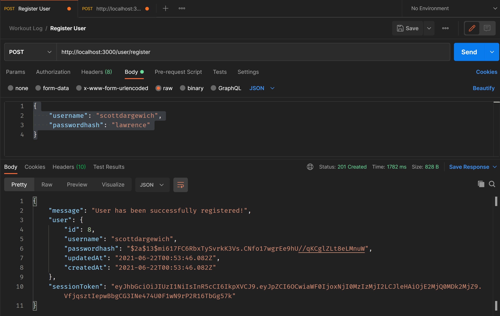
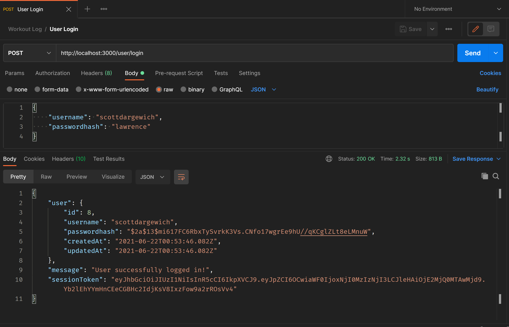
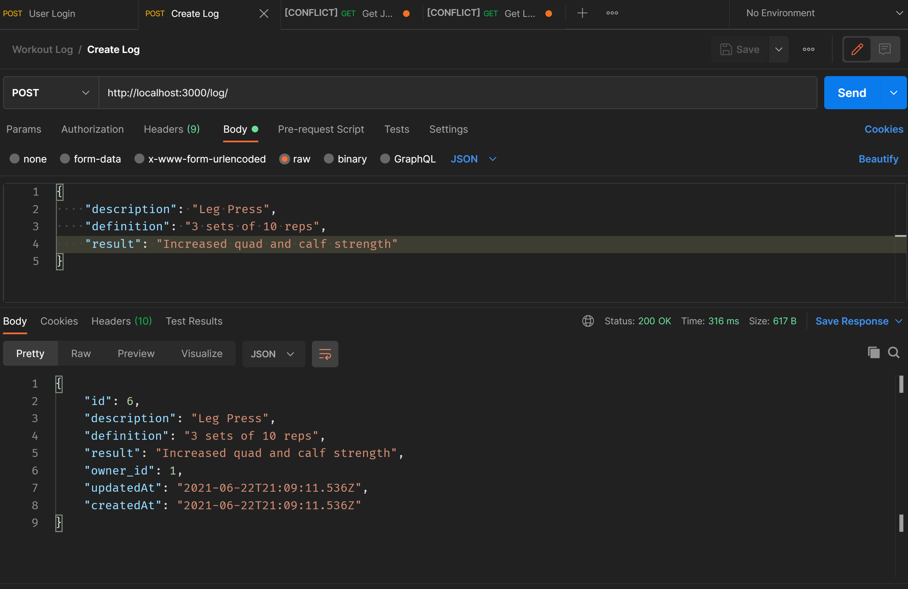
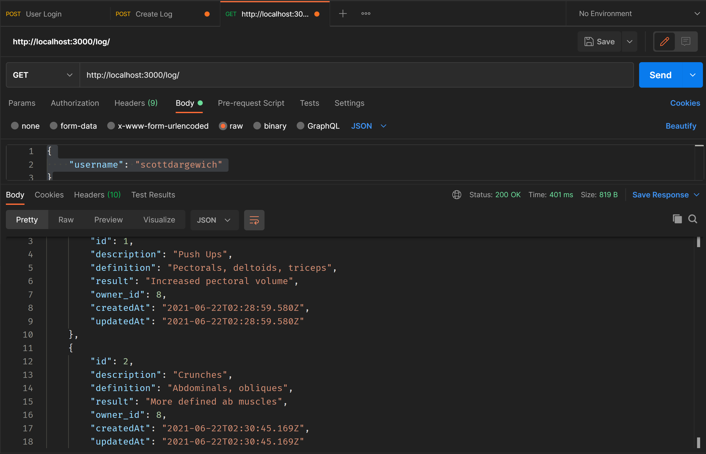
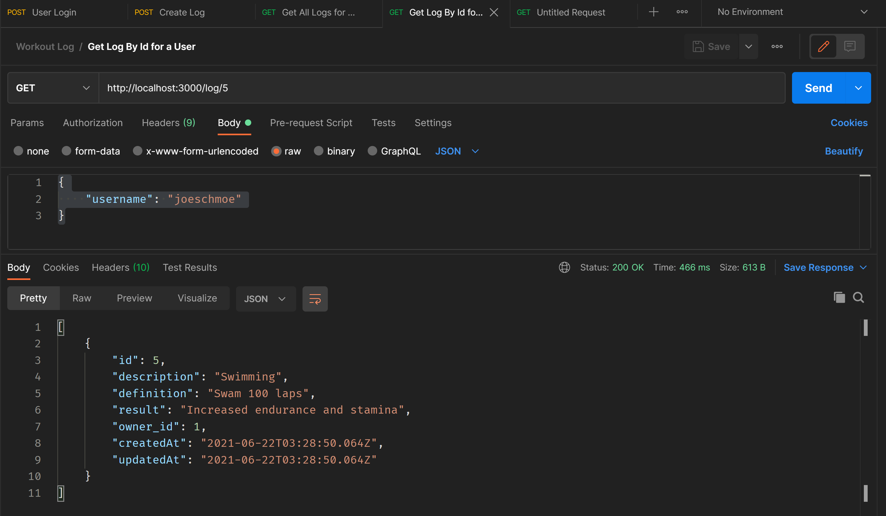
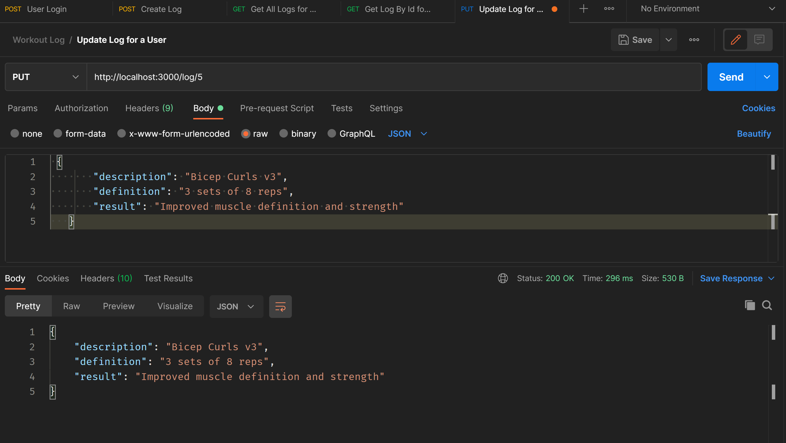
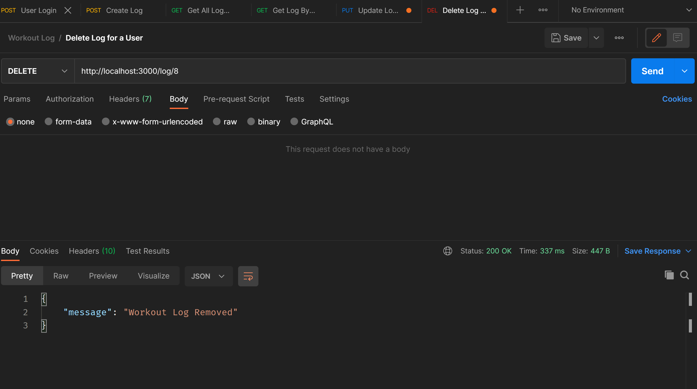

 # Workout Log Endpoints
 This is the server side to the Workout Log project. The repo for the client side can be found here: https://github.com/csimes/workout-log-client 
 */user/register* Endpoint (POST) - Allows a new user to be created with a username and password.
 
 
 */user/login* Endpoint (POST) - Allows log in with an existing user.
 
 
 */log/* Endpoint (POST) - Allows users to create a workout log with descriptions, definitions results and owner properties.
 
 
 */log/* Endpoint (GET) - Get all logs for an individual user.
 
 
 */log/:id* Endpoint (GET) - Gets individual logs by id for an individual user.
 
 
 */log/:id* Endpoint (PUT) - Allows individuals logs to be updated by a user.
 
 
 */log/:id* Endpoint (DELETE) - Allows individual logs to be deleted by a user.
 
